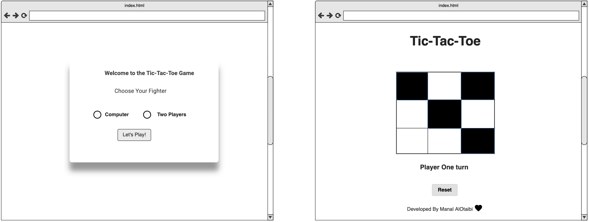

# Tic-Tac-Toe Game

### List of technologies :
* Mokups Wireframes
* HTML
* CSS
* JavaScript
* VS Code
* Jquery


### Link to wireframes and user stories.:


=======

### User Stories:

* As a player, I want to be notified when it is my turn and when it is the turn of the other player.
* As a Player, i want to be able to choose to play with my friend or with my computer
* As a Player , i want to see a beautiful Interface ,so i can play over and over again
* As a player, i want to be able to restart


### Planning/Development process and problem-solving strategy:
*  Create New Repository in GitHub Enterprise with the name of the project
*  Using terminal after i clone the new repo to create README.md and Index.html , main.js,style.css files
*  Create wireframe in Mokups website
*  Write user stories
*  make index.html as the main page of this game and link the javascript and css files with html file also
* Design the index.html by using css on style.css
* write the logic of this game in external sheet and pen before coding in main.js.

* turning these logics into actual game 
* test the game and add more features
### Unsolved Problems:
Nothing.
### Future Improvements:
* make some Interface improvement
* add LocalStorage to persist data locally to allow websites to continue after page refresh

## The logic of winner
* player must to click at any cell in a line (horizontally, vertically or diagonally) anywhere on the grid for winning

* first player who will start by clicking on any empty cells with pink color and the other play will play after him with blue color


## My favorite functions:


```bash
function checkForWinner() {
    winnerCond.forEach(combination => {
 
        if (combination.every(index => squares[index].classList.contains('player-one'))) {
      
            status.innerText = "Player One wins!"
            isTie = true //game over and stop clicking in the cells
        } else if (combination.every(index => squares[index].classList.contains('player-two'))) {
            status.innerText = "Player Two wins!"
            isTie = true
        } 
    })
}
const squares = Array.from(document.querySelectorAll('.cells'))
```


